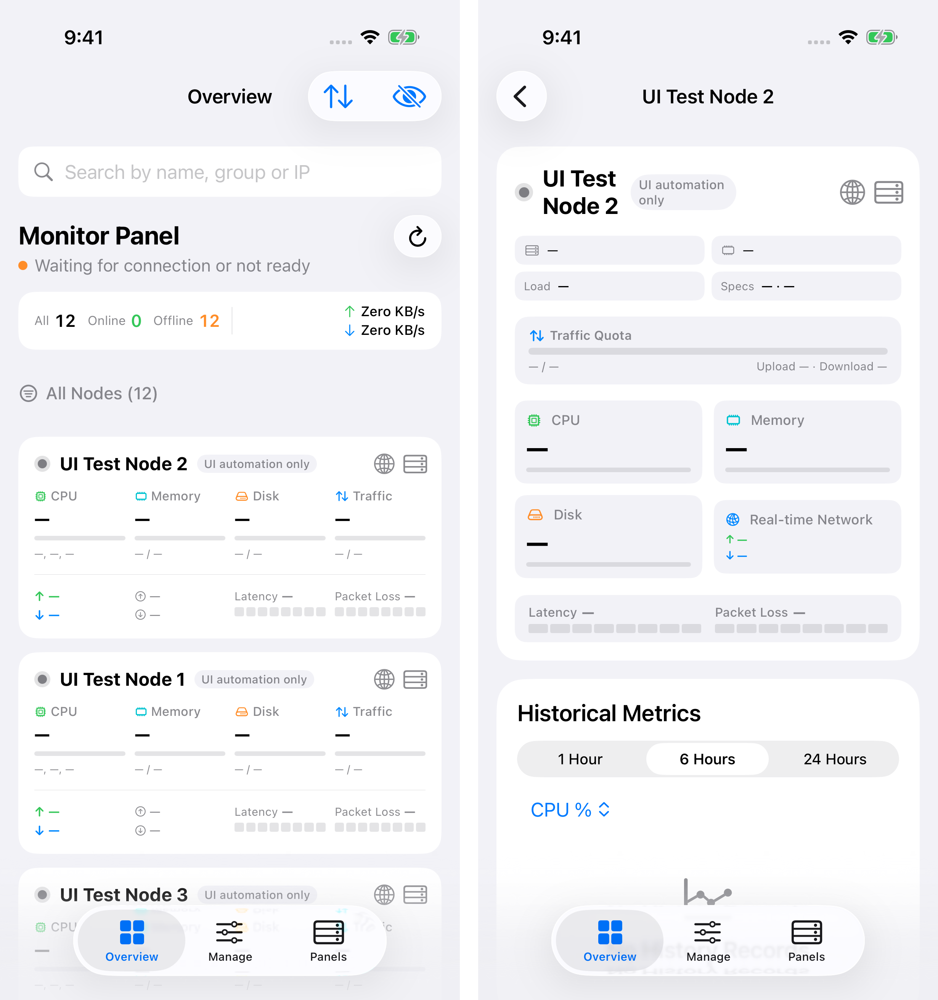

# Monitor Panel iOS

[English](README.md) | [简体中文](README.zh-CN.md) | [繁體中文](README.zh-TW.md) | **한국어** | [日本語](README.ja.md)

iPhone과 iPad를 위한 네이티브 서버 모니터링 앱입니다. Komari, Nezha, DStatus 패널을 한곳에 연결하고 서버 상태를 확인하며, 모바일에서 Komari 노드를 관리할 수 있습니다.

SwiftUI로 제작되었으며 iOS 16 이상을 지원합니다. iOS 26에서는 Liquid Glass 인터페이스를 제공합니다.

## 미리 보기

<p align="center">
  
</p>

## 주요 기능

- **다양한 백엔드** — Komari 모니터링 및 관리, Nezha V1·V0와 공개 DStatus 패널의 읽기 전용 모니터링을 지원합니다.
- **서버 개요** — 노드 상태, CPU, 메모리, 디스크, 트래픽, 실시간 네트워크 속도와 백엔드에서 제공하는 지연 시간 지표를 확인합니다.
- **노드 상세 정보** — 하드웨어 정보와 과거 지표를 확인하고, 카드에서 상세 화면으로 부드럽게 전환합니다.
- **Komari 관리** — 노드 편집, Ping 작업 및 알림 관리, 확인 후 원격 명령 실행, 감사 로그 조회를 지원합니다.
- **개인화** — 노드 검색·정렬·숨기기, 라이트·다크 테마와 사용자 지정 강조색을 지원합니다.
- **다국어** — 중국어 간체·번체, 영어, 일본어, 한국어를 지원합니다.
- **직접 연결과 개인정보 보호** — 자격 증명은 iOS Keychain에 저장하며, 기본적으로 HTTPS를 사용합니다. 중계 서비스나 분석·추적 SDK를 사용하지 않습니다.

## 다운로드 및 설치

**iOS / iPadOS 16.0 이상**이 필요합니다.

1. [Releases](https://github.com/Likhixang/Monitor-Panel-iOS/releases/latest)에서 `Monitor-Panel-iOS-unsigned.ipa`를 다운로드합니다.
2. SideStore, AltStore 또는 개인 서명 인증서로 서명하여 설치합니다.
3. **패널 → 패널 추가**에서 백엔드를 선택하고 주소와 자격 증명을 입력합니다. 공개 DStatus 패널에는 API key가 필요하지 않습니다.

## 로컬 빌드

**macOS, Xcode 26, XcodeGen**이 필요합니다. 타사 런타임 의존성은 없습니다.

```sh
brew install xcodegen
xcodegen generate
open KomariPanel.xcodeproj
```

기기에 설치하려면 Xcode에서 본인의 서명 팀을 선택하고 코드 서명을 활성화하세요.
