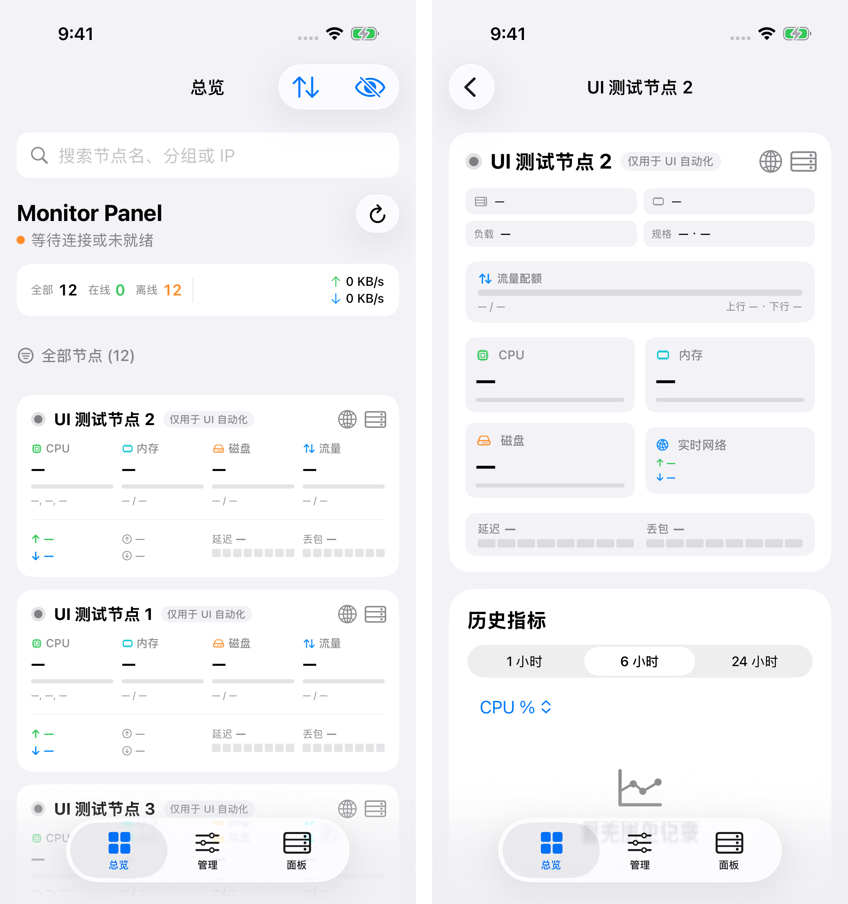

# Monitor Panel iOS

[English](README.md) | [简体中文](README.zh-CN.md) | **繁體中文** | [한국어](README.ko.md) | [日本語](README.ja.md)

一款適用於 iPhone 和 iPad 的原生伺服器監控應用程式。統一連接 Komari、哪吒和 DStatus 面板，隨時查看伺服器運作狀態，並在手機上管理 Komari 節點。

以 SwiftUI 打造，支援 iOS 16 以上系統，在 iOS 26 上呈現 Liquid Glass 介面。

## 介面預覽

<p align="center">
  
</p>

## 核心功能

- **多後端支援** — 支援 Komari 監控與管理，以及哪吒 V1、哪吒 V0 和 DStatus 公開面板的唯讀監控。
- **伺服器總覽** — 集中查看節點狀態、CPU、記憶體、磁碟、流量、即時網速及後端提供的延遲指標。
- **節點詳情** — 查看硬體資訊與歷史指標，流暢切換卡片和詳情頁面。
- **Komari 管理** — 編輯節點、管理 Ping 任務和警報、確認執行遠端命令、查看稽核日誌。
- **個人化設定** — 搜尋、排序和隱藏節點，自選淺色或深色主題與強調色。
- **多語言介面** — 支援簡體中文、繁體中文、English、日本語和한국어。
- **直接連線與隱私** — 憑證儲存在 iOS Keychain，預設使用 HTTPS，無中繼服務或分析追蹤 SDK。

## 下載與安裝

需要 **iOS / iPadOS 16.0 或更新版本**。

1. 從 [Releases](https://github.com/Likhixang/Monitor-Panel-iOS/releases/latest) 下載 `Monitor-Panel-iOS-unsigned.ipa`。
2. 使用 SideStore、AltStore 或自己的簽署憑證進行簽署安裝。
3. 開啟 **面板 → 新增面板**，選擇後端並填寫位址和憑證。DStatus 公開面板無需 API key。

## 本機建置

需要 **macOS、Xcode 26 和 XcodeGen**，無第三方執行階段相依套件。

```sh
brew install xcodegen
xcodegen generate
open KomariPanel.xcodeproj
```

若要安裝至裝置，請在 Xcode 中選擇自己的簽署團隊並啟用程式碼簽署。
